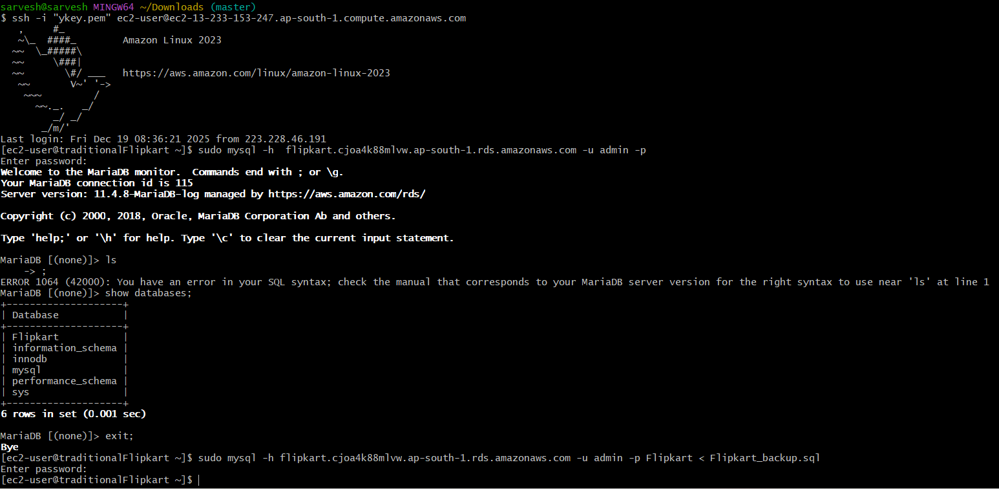
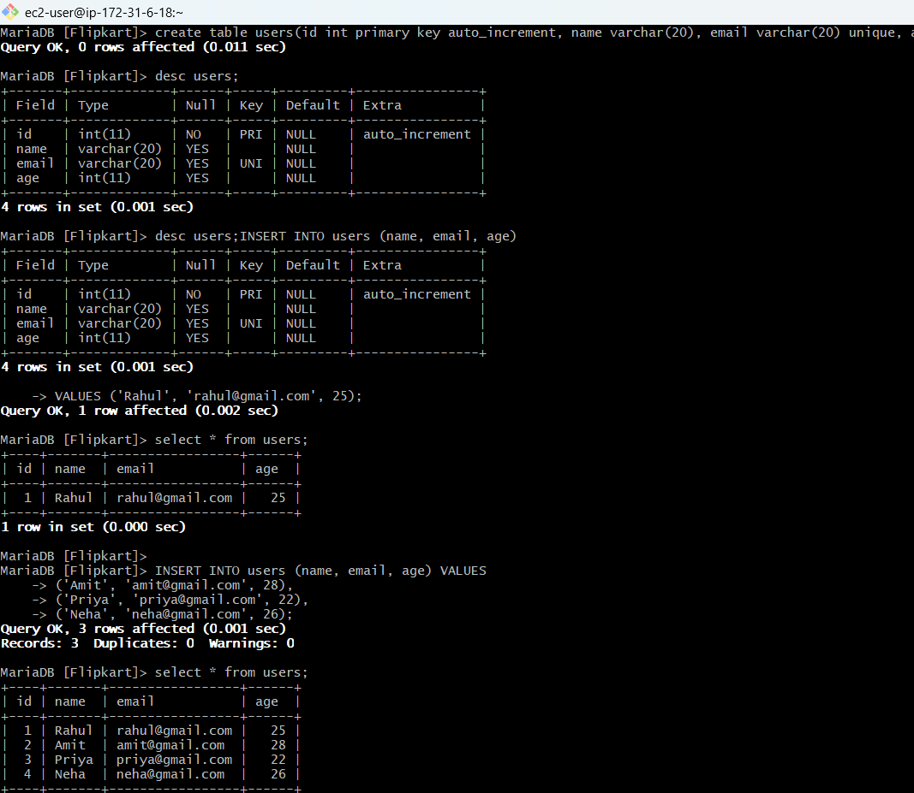
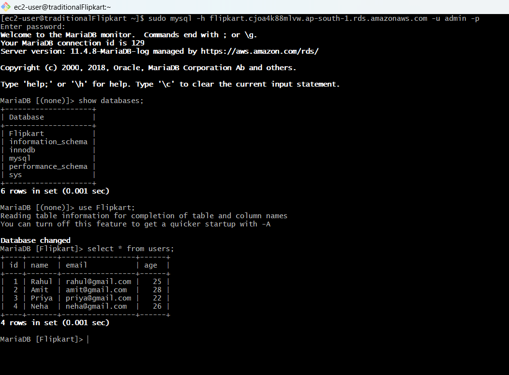

# Data Migration from Traditional DB to RDS (Relation Databases Services)

##  Overview
This guide explains how to migrate databases to Amazon RDS with minimal downtime.
Supported migration approaches:

RDS Snapshot Migration

 Dump & Restore

---
##  Migration Options
##  Snapshot Migration (Traditional_DB → RDS Only) ##

 ** Prerequisites**<br>
-  AWS Account

-  RDS instance created

-  DB credentials

-  Security Group allowing access from your machine / server

- DB client installed (mysql / psql)

##  Architecture


## 1️⃣ Dump & Restore 
MySQL / MariaDB<br>

```bash
mysqldump -h ENDPOINT_HOST -u root -p DB_NAME > backup.sql
```
Example

 ```bash
 sudo mysql -h endpoint_of_RDS -u root DB_name_of_traditional > file_name_backup.sql
 ```
 ## 2️⃣ Database Migration 
 ```bash
mysqldump -h ENDPOINT_HOST -u root -p DB_NAME < backup.sql
```
Example of Database Migration
```bash
sudo mysql -h endpoint_of_RDS -u root/admin -p DB_name_of_RDS < file_name_backup.sql
```
### 3️⃣ Database Migration Service Diagram


 
 ### 4️⃣ Output

 ## Traditional Databases record
 
 

## Map with RDS (Traditional -> RDS)
 

## 📌 Summary 
#### Transfer data or database object from source database (traditional) to destination database (RDS)


